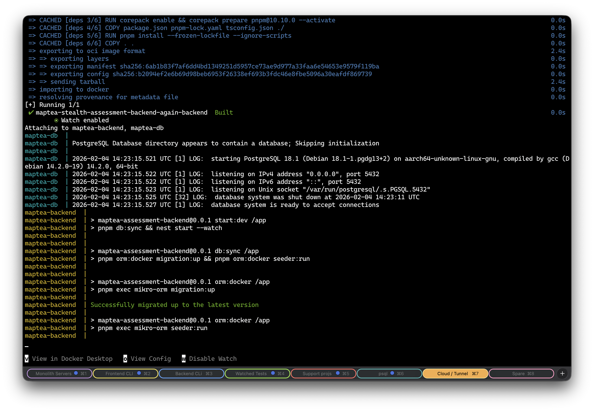
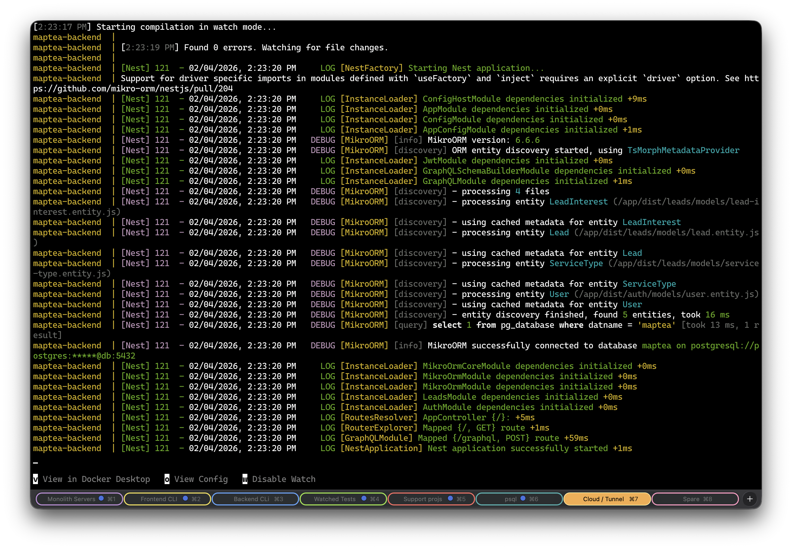

# Maptea Backend Assessment

This is a simple GraphQL backend, featuring creation and retrieval of leads and their interests.

> [!WARNING]
> **Disclaimer**: The leads module was redone, as the recruiter advised to start all over again.
> Rather than starting from scratch, the [solution to the previous assessment](https://github.com/myknbani/maptea-stealth-assessment-backend)
> was used as _"boilerplate"_.

> [!NOTE]
> Some commits with similar timestamps are from `git rebase --autosquash`ing fixed-up commits.
> Nothing automated or AI-generated :relaxed:.

## Tech Stack

- Backend framework: [Nestjs](https://nestjs.com/)
- ORM: [MikroORM](https://mikro-orm.io/)
- Database: [PostgreSQL](https://www.postgresql.org/)

This also uses [pnpm](https://pnpm.io/) as a package manager for features such as disk space savings
and faster (symlinked) installs.

## Getting Started

**This is hosted in https://stackslurper.xyz/graphql**

1. Clone:

```sh
git clone git@github.com:myknbani/maptea-stealth-assessment-backend.git

# or HTTPS
git clone https://github.com/myknbani/maptea-stealth-assessment-backend.git
```

2. Create `.env` file

```sh
PORT=3001
JWT_SECRET="DMOhLxCiaiNJQSw1c06Vk09A5tnSckM5S7w6lsauOJM"
DATABASE_URL="postgresql://postgres:postgres@db:5432/maptea"
```

3. Run via Docker Compose for One-command Quickstart

A Docker Compose file is provided. This way you can run the entire repo without installing Node.js,
PostgreSQL, etc. on your OS.

- It needs [v2.22](https://docs.docker.com/compose/how-tos/file-watch/) or higher to use `--watch` mode.
- If you have an older version, you can just use `docker-compose up` instead.
  - The watch mode is for rebuilding the Docker image when new dependencies are added/updated/removed.

```sh
docker-compose up --build --watch
```

- Migrations and seeders (the 3 service types + one dummy user) will run:
  
- The backend will then run, and GraphiQL will be available at: http://localhost:3001/graphql
  

## Architecture

[3-layer architecture](https://github.com/goldbergyoni/nodebestpractices/blob/master/sections/projectstructre/createlayers.md)

- entry point will be GraphQL resolvers
  - this allows a possibility of using other entry points (e.g. REST, gRPC, or event-driven "doors"
    to other microservices)
  - `*.resolver.ts` files - very lean code, usually just delegating to services
- business logic will be in services
  - business logic goes here, and is GraphQL-agnostic and DB/ORM-agnostic as possible
  - `*.service.ts` files - fatter code
- data access supposedly in repositories
  - complicated `.find*` queries go here, or even falling back to raw SQL
  - `*.repository.ts` files
  - this project is simple enough that repositories are not yet needed
- models
  - `*.entity.ts` files - these are the MikroORM entities, and form the base of validation rules
  - `*.input.ts` files - these are the GraphQL input types, extracted from entities for DRY code

## Sample cURL Requests

### `register` mutation

```sh
curl -s -X POST https://stackslurper.xyz/graphql \
  -H "Content-Type: application/json" \
  -H "Accept: application/json" \
  -d @- <<EOF | jq
{
  "query": "mutation RegistrationMutation(\$newLead: CreateLeadInput!) {
    register(newLeadData: \$newLead) {
      id
      serviceTypes {
        id
        name
      }
      fullName
      email
      mobileNumber
      postCode
      createdAt
    }
  }",
  "variables": {
    "newLead": {
      "fullName": "Mike Coo",
      "email": "mike+3@gov.us",
      "mobileNumber": "+639195050505",
      "postCode": "5088",
      "serviceTypeNames": ["pick-up", "payment"]
    }
  }
}
EOF
```

yields

```json
{
  "data": {
    "register": {
      "id": 3,
      "serviceTypes": [
        {
          "id": 2,
          "name": "pick-up"
        },
        {
          "id": 3,
          "name": "payment"
        }
      ],
      "fullName": "Mike Coo",
      "email": "mike+3@gov.us",
      "mobileNumber": "+639195050505",
      "postCode": "5088",
      "createdAt": "2026-02-04T14:56:46.865Z"
    }
  }
}
```

---

### `leads` query

```sh
curl -s -X POST https://stackslurper.xyz/graphql \
  -H "Content-Type: application/json" \
  -H "Accept: application/json" \
  -d @- <<EOF | jq
{
  "query": "query GetLeads(\$paginationOptions: ListLeadsInput!) {
    leads(listLeadsInput: \$paginationOptions) {
      pageInfo {
        itemsPerPage
        currentPage
        totalItemsCount
        hasNextPage
        hasPreviousPage
        offset
      }
      records {
        serviceTypes {
          name
        }
        fullName
        email
      }
    }
  }",
  "variables": {
    "paginationOptions": {
      "itemsPerPage": 2,
      "currentPage": 2
    }
  }
}
EOF
```

yields:

```json
{
  "data": {
    "leads": {
      "pageInfo": {
        "itemsPerPage": 2,
        "currentPage": 2,
        "totalItemsCount": 3,
        "hasNextPage": false,
        "hasPreviousPage": true,
        "offset": 2
      },
      "records": [
        {
          "serviceTypes": [
            {
              "name": "pick-up"
            },
            {
              "name": "payment"
            }
          ],
          "fullName": "Mike Coo",
          "email": "mike+3@gov.us"
        }
      ]
    }
  }
}
```

---

### `lead` query

```sh
curl -s -X POST https://stackslurper.xyz/graphql \
  -H "Content-Type: application/json" \
  -H "Accept: application/json" \
  -d @- <<EOF | jq
{
  "query": "query GetLead(\$id: Int!) {
    lead(id: \$id) {
      id
      serviceTypes {
        name
      }
      fullName
      email
    }
  }",
  "variables": {
    "id": 2
  }
}
EOF
```

yields

```json
{
  "data": {
    "lead": {
      "id": 2,
      "serviceTypes": [
        {
          "name": "pick-up"
        },
        {
          "name": "payment"
        }
      ],
      "fullName": "Mike Coo",
      "email": "mike+another@gov.us"
    }
  }
}
```
